# Coinwatch

Coinwatch is a daily batch data platform that ingests Binance market data through Azure Data Factory, stores the raw data in ADLS Gen2, transforms it in Databricks using a Delta Lake medallion architecture, and publishes analytical datasets to Power BI.

The complete chain runs from a single ADF pipeline without manual processing.

**Stack:** Azure Data Factory · ADLS Gen2 · Azure Databricks · PySpark · Delta Lake · Databricks SQL · Power BI · Python · pytest

## Dashboard


## Architecture

```mermaid
graph LR
    subgraph Sources
        BINANCE[data.binance.vision<br/>daily Binance kline files]
    end

    subgraph Azure
        ADF[Azure Data Factory<br/>metadata-driven ingestion]
        BRONZE[(ADLS Gen2<br/>bronze)]
        DB[Azure Databricks<br/>PySpark]
        SILVER[(silver.candles<br/>Delta)]
        GOLD[(gold analytics marts<br/>Delta)]
        SQLWH[Databricks SQL warehouse]
    end

    MODEL[Power BI<br/>semantic model]
    REPORT[Power BI<br/>report]

    BINANCE -->|download daily files| ADF
    ADF -->|copy without transformation| BRONZE
    BRONZE -->|type, validate and deduplicate| DB
    DB -->|MERGE by symbol and open time| SILVER
    SILVER -->|calculate analytics| GOLD
    GOLD -->|serve through SQL| SQLWH
    SQLWH -->|refresh semantic model| MODEL
    MODEL --> REPORT
```



One ADF pipeline runs the complete daily chain. Adding another trading symbol is a configuration change rather than a pipeline-code change.

## Data flow

### 1. Ingestion

ADF reads the configured symbols, loops over them and downloads the daily Binance kline files.

The files are written to bronze using partitioned paths such as:

```text
bronze/binance/klines/symbol=BTCUSDT/date=2026-06-10/
```

ADF only moves the data. It does not transform it.

**Decision:** bronze remains raw so the original source data can be replayed when transformation logic changes.

### 2. Bronze to silver

Databricks reads the raw Binance data, applies an explicit schema, converts timestamps, validates the rows and removes duplicates.

The cleaned candles are written to the Delta table:

```text
coinwatch.silver.candles
```

Silver uses `MERGE` on `symbol` and `open_time`.

**Decision:** rerunning the same date updates or inserts records without creating duplicate candles.

### 3. Silver to gold

Databricks transforms the candle data into analytical gold marts for:

- daily market metrics;
- rolling volatility;
- volume anomalies;
- data completeness.

**Decision:** Power BI reads prepared business answers from gold instead of recalculating analytics from the detailed silver table.

### 4. Gold to Power BI

The gold tables are exposed through a Databricks SQL warehouse and loaded into a Power BI semantic model.

**Decision:** Power BI Import mode is appropriate because the gold datasets are small and refresh on a schedule. Databricks compute does not need to remain in the interactive report path.

## Cost

The following costs cover the development period from `<start date>` to `<end date>`.

| Component | Cost | Notes |
|---|---:|---|
| ADLS Gen2 | €... | Bronze, silver and gold storage |
| Azure Data Factory | €... | Pipeline, copy and debug executions |
| Azure Databricks | €... | Transformation job compute |
| Databricks SQL warehouse | €... | Power BI serving layer |
| Power BI / Fabric | Trial / €... | Semantic model and report |
| **Total** | **€...** | Total project cost |

### Cost lessons

- ADF debug executions are real activity executions, so development was tested with only a small symbol configuration first.
- Databricks compute should terminate automatically after processing.
- The SQL warehouse should use auto-stop.
- Import mode prevents Databricks SQL compute from being required for every report interaction.

## Design decisions

### Bronze stays raw

Bronze stores the source data without business transformations. This makes historical replay possible when transformation logic changes.

### Silver uses Delta MERGE

The silver layer is idempotent. Processing the same symbol and date again does not duplicate the candles.

### Gold contains purpose-built marts

The dashboard reads precomputed metrics rather than performing complex calculations against the detailed candle table.

### Orchestration stays in ADF

ADF controls ingestion and starts the Databricks workflow. Databricks performs the transformations.

## What I would do differently

### Introduce a star schema

The current gold marts are largely self-contained. This keeps the first version simple, but limits shared dimensions and cross-report filtering.

A later version should introduce structures such as `dim_asset`, `dim_date` and suitable fact tables.

### Detect completely missing ingestion days

The current completeness logic checks days that reached silver. A day that was never ingested may have no record to evaluate.

A stronger implementation would generate the expected symbol-and-date combinations independently from the ingested data.

### Add incremental gold processing when necessary

Gold currently uses full refreshes because the datasets are small.

Incremental processing should be added when the compute cost of rebuilding gold becomes greater than the complexity of maintaining incremental state.

### Improve Power BI source control

The Power BI report currently exists mainly as a Power BI service item. A screenshot documents the result, but it is not full version control for the report definition.

### Improve monitoring and backfills

The current orchestration does not yet include complete alerting, configurable backfills, advanced retry handling or automated data-quality gates.

## Repository structure

```text
.claude/       Local Claude configuration; excluded from Git
.github/       GitHub Actions workflows
dataset/       Azure Data Factory dataset definitions
factory/       Azure Data Factory factory definition
ingestion/     Ingestion-related Python code
linkedService/ Azure Data Factory linked-service definitions
notebooks/     Databricks transformation notebooks
pipeline/      Azure Data Factory pipeline definitions
raw_data/      Local development or sample data
scripts/       Supporting scripts
sql/           SQL queries and definitions
tests/         Automated tests
```

The `.claude/` folder is intentionally local and is not included in the GitHub repository.

## Local development

### Prerequisites

- Python
- Docker
- Azure subscription
- Azure Data Factory
- ADLS Gen2
- Azure Databricks
- Power BI

### Python environment

Create and activate a virtual environment:

```bash
python -m venv .venv
source .venv/bin/activate
pip install -r requirements.txt
```

Run the tests:

```bash
pytest
```

### Local services

Start the local services defined in `docker-compose.yml`:

```bash
docker compose up -d
```

### Environment variables

Local credentials belong in `.env`.

The real `.env` file is excluded from Git and must never be committed.

## Status

Month 1 of the Coinwatch project is complete.

The current version provides an end-to-end daily batch flow from Binance ingestion through Azure Data Factory, ADLS Gen2, Databricks and Power BI.

Planned improvements include dimensional modelling, stronger data-quality checks, monitoring, automated deployment and backfill support.